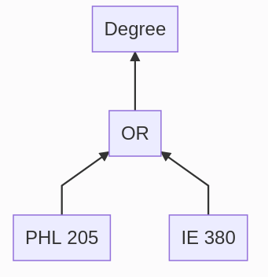

# Degree Tree Network
The idea of this project is to visualize a college degree program as a tree network. A single, top level node will represent the degree, and a hierarchy of the required courses will branch down from it. This might serve as an advising tool for students planning their schedule or choosing a major.

We use a few degrees from Oregon State as examples. [Catalog data acquisition](catalog_data_acquisition) scrapes course prerequisites from OSU's catalog. [Degree requirements](degree_requirements) scrapes degree requirements from OSU's catalog. [Parse course requirements](parse_course_requirements) processes more complicated requirements. [d3](d3) visualizes this data. 

## Proposed method for implementing uncertainty in a tree
Degree requirements at OSU are generally expressed as a list of OR conditions. For example, an ecological engineering student must take "Ethics" or "The Responsible Engineer".

Sometimes, these conditions require a variable amount of courses from a variable amount of options. For example, a computational physics student must take two of three available senior capstone courses.

These conditions introduce uncertainty in the tree network. We suggest using an "OR node" to account for this.


```
graph BT;
    A[PHL 205]-->B[OR];
    C[IE 380]-->B;
    B-->D[Degree];
```

We also define the "order" of the node as the amount of prerequisite nodes it requires to be satisfied. In the ethics requirement example, only one course is required so the OR node order is 1.

The goal of this project is to visualize all possible paths through a degree program by displaying all courses and OR nodes for a degree program. As a student makes decisions in which courses they take (either completed or planned), the network can be trimmed down and redrawn to eliminate OR nodes. A user interface will allow the student to trim the tree by selecting planned courses.

## Proposed constraints
### 1. No class is drawn more than once
This rule ensures that the network is a tree.

### 2. OR conditions are represented by a single node, with connections to each option
OR conditions represent uncertainty.

### 3. OR nodes have an "order" property that determines how many prerequisite courses it requires to be satisfied
This lets the condition be represented by a single node. This avoids using hierarchies of OR nodes to represent conditions with orders greater than 1, which is visually complicated.

### 4. OR nodes are removed once its "order" is met
By choosing courses that satisfy the condition, that requirement, OR nodes and branches of the tree may be eliminated.

### 5. Tree redraws itself upon selection in condition
With each decision, the network must reevaluate which branches exist given the remaining nodes.

### 6. Conditions begin unselected
The network displays all possible outcomes, which the user narrows down until they have their specific degree plan.
